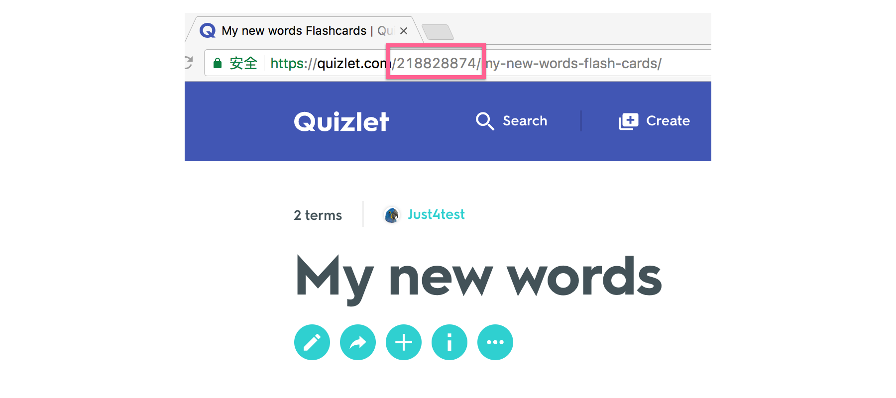

# How to Install
## 1. Get oauth code
Click [here](https://quizlet.com/authorize)

Your access token is xxxx.

## 2. Get set ID
Open Quizlet in a browser,  navigate to one of your set, you can find set ID in the address bar.

